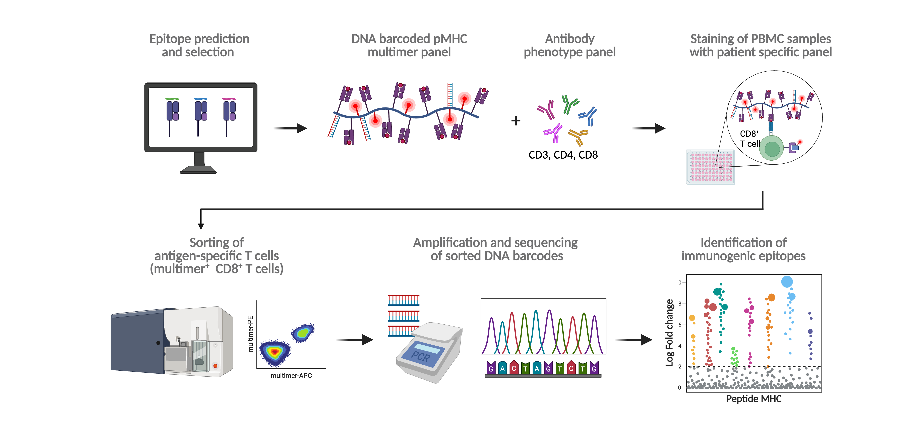
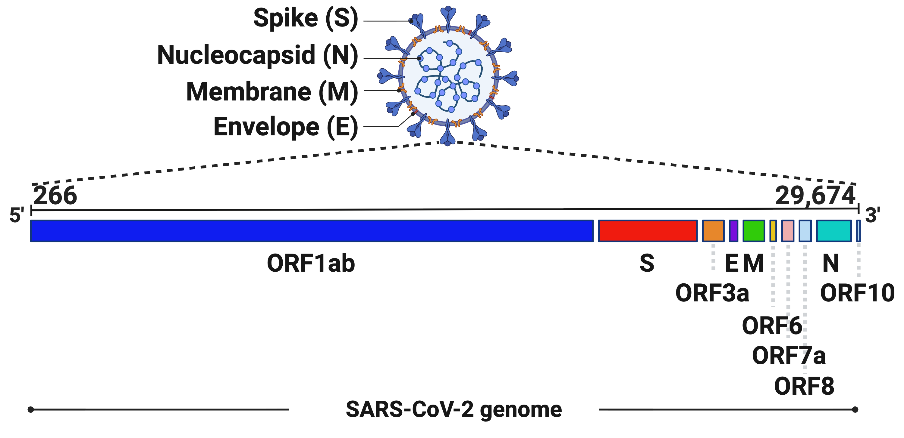
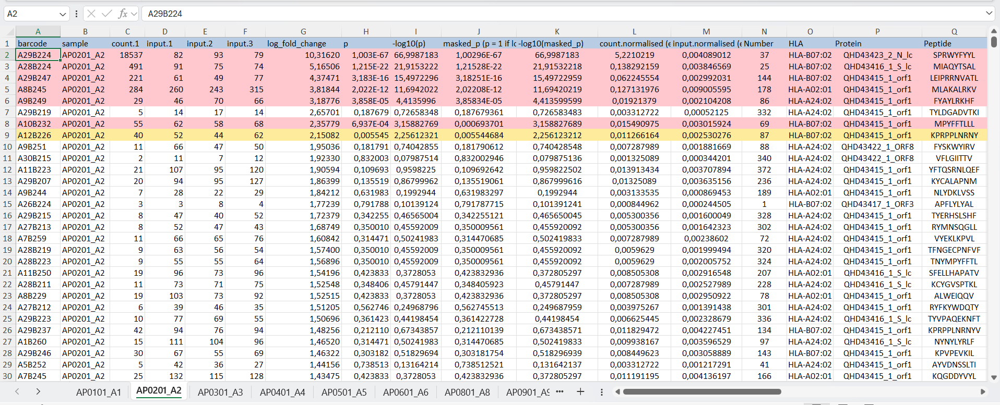
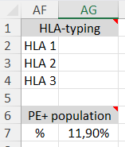

## Introduction

Where does the data come from?

{fig-align="center"}

## Introduction

{fig-align="right" width="1500"}

## Materials - Raw Data

::: {style="text-align:center; margin-bottom:-10px;"}
{width="100%"}
:::

::::::: columns
:::: {.column width="30%"}
::: {style="text-align:center; margin-top: -10px"}
{width="40%"}
:::
::::

:::: {.column width="70%"}
::: {style="text-align:center; magrin-top: -10px"}
{width="90%"}
:::
::::
:::::::

## Methods -Loading Data

```{r}
#| eval: true
#| echo: false
# Load libraries -----------------------------------------------------------
library(readxl)     # reading Excel files
library(tidyverse)  # tidy data tools including write_tsv()
library(here)       # reproducible file paths
library(purrr)
source(here("R", "99_proj_func.R"))
library(patchwork)
# functional programming: map(), imap()
```

<small>

```{r}
#| eval: false
#| echo: true
#| message: false

# Dynamically build path so the script works on any machine
raw_file_path <- here("data", "_raw", "AP_cohort_COVID_1_raw.xlsx")

# Retrieve all sheet names
sheet_names <- excel_sheets(raw_file_path)

# Read each sheet as a tibble and store them in a named list
sheet_list <- map(sheet_names, ~ read_xlsx(raw_file_path, sheet = .x))
names(sheet_list) <- sheet_names
```

<br>

```{r}
#| eval: false
#| echo: true
# Export sheets to TSV files -----------------------------------------------
out_dir <- here("data", "sheets_tsv")

# Write each sheet as a tsv file
sheet_list|>
  imap(
    ~write_tsv(.x, str_c(out_dir, "/", .y, ".tsv")))
  

```

</small>

## Methods - Cleaning Data

<small>

::: {.column width="50%"}
-   Combine all sheets into one table with `load_tsvData()` + `map_dfr()`
-   Fix column type for `-log10(masked_p)` via `col_spec`
-   Derive **MultimerFrequency per sample** from frequency column (`...33`)
-   Drop non-data rows: remove rows with missing `barcode`
-   Keep only analysis-relevant variables
-   Create a simple `sampleID`, clean `HLA`, and tidy `Protein` names
:::

::: {.column width="50%"}
```{r}
#|eval: false
#| warning: false
#| echo: true

# Define data folder and list patient files --------------------------------
tsv_folder <- here("data", "sheets_tsv")

patient_files <- list.files(
  path = tsv_folder
)


# Define correct spec for column which raised error ------------------------
col_spec <- cols(
  `-log10(masked_p)` = col_double()
)

```

```{r}
#| echo: true
#| eval: true
combined_data <- patient_files |> 
  map_dfr( 
    ~load_tsvData( 
      filename = .x, 
      folder = tsv_folder, 
      col_types = col_spec, 
      na = c("NA", "N/A", "---"), 
      show_col_types = FALSE 
      ) 
    ) |> 
  group_by(sample) |> 
  rename(freq = ...33) |> 
  mutate(
    MultimerFrequency = sum(replace_na(freq, 0))) |>
  ungroup() |> 
  drop_na(barcode)

clean_data <- combined_data |> 
  select( 
    sample, count.1, input.1, input.2, input.3,
    log_fold_change, p, HLA, Protein, Peptide,
    MultimerFrequency ) |> 
  mutate( 
    sampleID = str_remove(sample, "_.*$"), 
    sampleID = str_sub(sampleID, start = 3, end = 4), 
    HLA = str_remove(HLA, "HLA-") )


```
:::

</small>

## Methods - Augment Data

<small>

::: {.column width="50%"}
From cleaned dataset `02_data_clean.tsv`

Add **HLA–peptide identifier**: `HLA-peptide`

Define **binary response**: `log_fold_change >= 2` and `p < 0.05` → response = 1

Compute **response_count per sample**: sum of `count.1` for responses

Estimate **peptide frequency per sample**:

-   `estimated_frequency` for responding rows:
    -   `count.1 / response_count * MultimerFrequency`
-   non-responders or no responses → 0
:::

::: {.column width="50%"}
```{r}
#| echo: true
aug_data <- clean_data |>
  mutate(`HLA-peptide` = str_c(HLA, Peptide, sep = "-")) |>
  mutate(
    response = if_else(
      log_fold_change >= 2.0 & p < 0.05,
      1L, 0L
    )
  ) |>
  group_by(sample) |>
  mutate(response_count = sum(count.1 * response)) |>
  ungroup() |>
  mutate(
    estimated_frequency = case_when(
      response_count == 0 ~ 0,
      response == 1 ~ (count.1 / response_count) * MultimerFrequency,
      TRUE ~ 0
    )
  ) |>
  group_by(sample) |>
  mutate(total_estimated_frequency = sum(estimated_frequency)) |>
  ungroup()
```
:::

</small>

## T cell responses across HLAs {.scrollable}

```{r}
experiment_data <- load_tsvData("03_data_augment.tsv", show_col_types = FALSE)

protein_colors <- c(
  "ORF1" = "#009E73",
  "S" = "#56B4E9",  
   "ORF3"= "#D55E00",
  "ORF6" = "#CC79A7",
  "ORF7" = "#00AFAA",
  "ORF8" = "#F0E442",
  "ORF10" = "#0099BB",
  "E" = "#0072B2",
  "M" =  "#E69F00",
  "N" = "#5A61FF"
)  

extras <- experiment_data |>
  mutate(
    point_color = if_else(response == 0, "grey",protein_colors [Protein]),     
    point_fill  = if_else(response == 0, "grey", protein_colors [Protein]),
    HLA = factor(HLA, levels = c("A01:01","A02:01","A03:01","A24:02", "B07:02", "B08:01", "B15:01")))
```

```{r}
#how many peptides per HLA for positive T-responses
extract_data <- 
  experiment_data|>
  mutate(HLA = str_remove(HLA, ":"))|>
  filter(response ==1)|>
  group_by(HLA)|>
  summarize(peptidesPerHLA = n_distinct(Peptide))|>
  ungroup()|>
  #order HLA descending + fixes appearance for plotting
  arrange(desc(HLA)) |> 
  mutate(HLA = fct_inorder(HLA))

#compute all peptides per HLA independent of positive/negative T-responses
totalPeptidesPerHLA <- experiment_data|>
  group_by(HLA)|>
  summarize(totalPeptidesPerHLA = n_distinct(Peptide)) |> 
  arrange(desc(HLA)) |> 
  #also need the same order for combining correct values
  mutate(HLA = fct_inorder(HLA)) |>
  pull(totalPeptidesPerHLA)


```

. . .

```{r}
extras |> 
    ggplot(aes(
    x = `HLA-peptide`,
    y = log_fold_change,
    colour = point_color,
    fill   = point_fill,
    size = estimatedFrequency
  )) +
  geom_point() +

  facet_grid(~ HLA, scales = "free_x", space = "free") +
  geom_hline(yintercept = 2, linetype = "dashed") +
  scale_color_identity(guide = "none") +   
  scale_fill_identity(guide = "none") +
  scale_y_continuous(limits = c(0, NA), breaks = seq(0, 14, by = 2)) +
  #scale_y_break(breaks = c(0, 2)) +
 theme(
  panel.spacing = unit(0, "lines"),  
  panel.border = element_rect(colour = "grey", fill = NA, size = 0.3),
  strip.text = element_text(angle = 90, hjust = 0.5, size = 10, face = "bold"),
  legend.position = "bottom",
   axis.text.y.right = element_blank(),
  axis.ticks.y.right = element_blank(),
  strip.background = element_blank(),
  axis.text.x = element_blank(),
  axis.text.y.left = element_text(size = 12),
  title = element_text(size = 12),
    legend.title = element_text(size = 10)

   ) +

  labs(title = "Manhattan plot showing T cell responses against SARS-CoV-2 peptides across patients, by HLAs",
       x = "Peptide HLA pairs",
       y = "Log fold change",
       size = "Estimated frequency"
) 

```

. . .

::: columns
::: {.column width = "70%"}

```{r}

pl1 <- extract_data |>
  ggplot(
    aes(x= peptidesPerHLA, 
        y = HLA)
  ) + 
  geom_col(aes(width = 0.5), 
           fill = "navy")+
  geom_text(aes(label = peptidesPerHLA), hjust = -0.2)+
  scale_x_continuous(expand = expansion(mult = c(0,.2)))+
  labs(caption = "Number of HLA-specific\nSARS-CoV-2 epitopes")+
  theme(aspect.ratio = 2/1, 
        axis.title.x = element_blank(), 
        axis.title.y = element_blank(), 
        axis.ticks = element_line(color = "black"),
        axis.line = element_line(color = "black"),    
        panel.background = element_rect(fill = "white"),
        plot.caption = element_text(size = 12)
  )

pl2 <- extract_data |>
  mutate(
    percentage_peptides = peptidesPerHLA/totalPeptidesPerHLA * 100
  )|>

   ggplot(
    aes(x= percentage_peptides, 
        y = HLA)
  ) + 
  geom_col(aes(width = 0.5), 
           fill = "navy")+
  geom_text(aes(label = round(percentage_peptides, digits = 1)), 
            hjust = -0.2)+
  scale_x_continuous(expand = expansion(mult = c(0,.2)))+
  labs(caption = "Immunogenic peptides\n (%, normalized)")+
  theme(aspect.ratio = 2/1, 
        axis.title.x = element_blank(), 
        axis.title.y = element_blank(), 
        axis.text.y  = element_blank(),
        axis.ticks = element_line(color = "black"),
        axis.line = element_line(color = "black"),    
        panel.background = element_rect(fill = "white"),
    plot.caption = element_text(size = 12)
  )


combined <- pl1 | pl2 +
  plot_annotation(
    title = "Summary of HLA frequency for tested peptides",
    tag_levels = "A",
    theme = theme(
      plot.title = element_text(size = 14, hjust = 0.5)  # title size and alignment
    )
  )

print(combined)
```
:::

::: {.column width = "30%"}

The most immunogenic HLA in this cohort appears to be HLA-A:0201. ::: ::::

## Which protein generates the most immunogenic antigens? {.scrollable}

```{r}
extras <- experiment_data |>
  mutate(
    point_color = if_else(response == 0, "grey",protein_colors [Protein]),     
    point_fill  = if_else(response == 0, "grey", protein_colors [Protein]),
    Protein = factor(Protein, levels = c("ORF1","S","ORF3","N", "M", "ORF8", "ORF7", "ORF6","ORF10", "E")))
```

. . .

```{r}
  
extras |> 
    ggplot(aes(
    x = `HLA-peptide`,
    y = log_fold_change,
    colour = point_color,
    fill   = point_fill,
    size = estimatedFrequency
  )) +
  geom_point() +

  facet_grid(~ Protein, scales = "free_x", space = "free") +
  geom_hline(yintercept = 2, linetype = "dashed") +
  scale_color_identity(guide = "none") +   
  scale_fill_identity(guide = "none") +
  scale_y_continuous(limits = c(0, NA), breaks = seq(0, 14, by = 2)) +
  #scale_y_break(breaks = c(0, 2)) +
 theme(
  panel.spacing = unit(0, "lines"),  
  panel.border = element_rect(colour = "grey", fill = NA, size = 0.3),
  strip.text = element_text(angle = 90, hjust = 0.5, size = 10, face = "bold"),
  legend.position = "bottom",
   axis.text.y.right = element_blank(),
  axis.ticks.y.right = element_blank(),
  strip.background = element_blank(),
  axis.text.x = element_blank(),
  axis.text.y.left = element_text(size = 12),
  title = element_text(size = 12),
    legend.title = element_text(size = 10)

   ) +

  labs(title = "Manhattan plot of T cell responses against SARS-CoV-2 peptides across patients, by HLAs",
       x = "Peptide HLA pairs",
       y = "Log fold change",
       size = "Estimated frequency"
) 
```

. . .

::: columns
:::{.column width = "70%"}

```{r}
extract_data <- experiment_data|>
  group_by(Protein)|>
      summarize(total = n_distinct(`HLA-peptide`),
                number_Tcells = sum(response == 1))


pl1 <- extract_data |>
  ggplot(
    aes(x = number_Tcells,
        y = Protein,
        fill = Protein)
  )+
  geom_col(aes(width = 0.5))+
  scale_fill_manual(values = protein_colors) +
  geom_text(aes(label = number_Tcells),hjust = -0.2)+
  scale_x_continuous(expand = expansion(mult = c(0,.2)))+
  labs(caption = "SARS-CoV-2\nT cell responses")+
  theme(aspect.ratio = 2/1, 
        axis.title.x = element_blank(), 
        axis.title.y = element_blank(), 
        axis.ticks = element_line(color = "black"),
        axis.line = element_line(color = "black"),    
        panel.background = element_rect(fill = "white"),
        plot.caption = element_text(size = 12),
        legend.position = "none"
  )


pl2 <- extract_data |>
  mutate(
    percentage_peptides = number_Tcells/total * 100
  )|>
  ggplot(
    aes(x = percentage_peptides,
        y = Protein,
        fill = Protein)
  )+
  scale_fill_manual(values = protein_colors) +
  geom_col(aes(width = 0.5))+
  geom_text(aes(label = round(percentage_peptides, digits = 1)),hjust = -0.2)+
  scale_x_continuous(expand = expansion(mult = c(0,.2)))+
  labs(caption = "Immunogenic peptides\n(%, normalized)")+
  theme(aspect.ratio = 2/1, 
        axis.title.x = element_blank(), 
        axis.title.y = element_blank(),
        axis.text.y = element_blank(),
        axis.ticks = element_line(color = "black"),
        axis.line = element_line(color = "black"),    
        panel.background = element_rect(fill = "white"),
        plot.caption = element_text(size = 12),
        legend.position = "none"
  )
  
combined <- pl1 | pl2 +
  plot_layout(widths = c())

combined
```
:::

:::{.column width = "30%"}

::: {style="font-size: 22px;"}
Although ORF1 produced the most peptides, the most immunogenic protein, relative to its size, is ORF3.
:::

:::

::::

## Results 3

Ivan - figure 1I

## Results 4

Ivan - figure 2A
