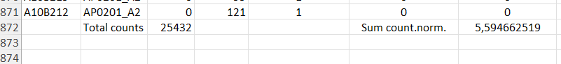

## Introduction

Where does the data come from?

.png){fig-align="center"}

## Introduction

{fig-align="center"}

## Materials - Raw Data

[Dataset from Saini et al., Science Immunology 2021. <a href="https://www.science.org/doi/10.1126/sciimmunol.abf7550" target="_blank">DOI</a>]{style="font-size:0.6em; color:gray; margin-top:-20px;"}

::: {style="text-align:center; margin-bottom:-20px; margin-top: -20px"}
{width="100%"}
:::

::::::: columns
:::: {.column width="30%"}
::: {style="text-align:center; margin-top: -20px"}
{width="40%"}
:::
::::

:::: {.column width="70%"}
::: {style="text-align:center; margin-top: -20px"}
{width="90%"}
:::
::::
:::::::

## Methods - Loading Data

```{r}
#| eval: true
#| echo: false
# Load libraries -----------------------------------------------------------
library(readxl)     # reading Excel files
library(tidyverse)  # tidy data tools including write_tsv()
library(here)       # reproducible file paths
library(purrr)
source(here("R", "99_proj_func.R"))
library(patchwork)
# functional programming: map(), imap()
```

```{r}
#| eval: false
#| echo: true
#| message: false

# Dynamically build path so the script works on any machine
raw_file_path <- here("data", "_raw", "AP_cohort_COVID_1_raw.xlsx")

# Retrieve all sheet names
sheet_names <- excel_sheets(raw_file_path)

# Read each sheet as a tibble and store them in a named list
sheet_list <- map(sheet_names, ~ read_xlsx(raw_file_path, sheet = .x))
names(sheet_list) <- sheet_names
```

<br>

```{r}
#| eval: false
#| echo: true
# Export sheets to TSV files -----------------------------------------------
out_dir <- here("data", "sheets_tsv")

# Write each sheet as a tsv file
sheet_list|>
  imap(
    ~write_tsv(.x, str_c(out_dir, "/", .y, ".tsv")))
  

```

## Methods - Cleaning Data

<small>

::: {.column width="50%"}
-   Combine all sheets into one table with `load_tsvData()` + `map_dfr()`
-   Derive **MultimerFrequency per sample**
-   Keep only analysis-relevant variables
-   Create a simple `sampleID`, clean `HLA`, and tidy `Protein` names
:::

::: {.column width="50%"}
```{r}
#|eval: false
#| warning: false
#| echo: true

# Define data folder and list patient files --------------------------------
tsv_folder <- here("data", "sheets_tsv")

patient_files <- list.files(
  path = tsv_folder
)


# Define correct spec for column which raised error ------------------------
col_spec <- cols(
  `-log10(masked_p)` = col_double()
)

```

```{r}
#| echo: true
#| eval: true
combined_data <- patient_files |> 
  map_dfr( 
    ~load_tsvData( 
      filename = .x, 
      folder = tsv_folder, 
      col_types = col_spec, 
      na = c("NA", "N/A", "---"), 
      show_col_types = FALSE 
      ) 
    ) |> 
  group_by(sample) |> 
  rename(freq = ...33) |> 
  mutate(
    MultimerFrequency = sum(replace_na(freq, 0))) |>
  ungroup() |> 
  drop_na(barcode)

clean_data <- combined_data |> 
  select( 
    sample, count.1, input.1, input.2, input.3,
    log_fold_change, p, HLA, Protein, Peptide,
    MultimerFrequency ) |> 
  mutate( 
    sampleID = str_remove(sample, "_.*$"), 
    sampleID = str_sub(sampleID, start = 3, end = 4), 
    HLA = str_remove(HLA, "HLA-") )


```
:::

</small>

## Methods - Augment Data

<small>

::: {.column width="50%"}
Define **binary response**: `log_fold_change >= 2` and `p < 0.05` → response =

Estimate **peptide frequency per sample**:

-   `estimated_frequency` for responding rows:
    -   `count.1 / response_count * MultimerFrequency`
-   non-responders or no responses → 0
:::

::: {.column width="50%"}
```{r}
#| echo: true
aug_data <- clean_data |>
  mutate(`HLA-peptide` = str_c(HLA, Peptide, sep = "-")) |>
  mutate(
    response = if_else(
      log_fold_change >= 2.0 & p < 0.05,
      1L, 0L
    )
  ) |>
  group_by(sample) |>
  mutate(response_count = sum(count.1 * response)) |>
  ungroup() |>
  mutate(
    estimated_frequency = case_when(
      response_count == 0 ~ 0,
      response == 1 ~ (count.1 / response_count) * MultimerFrequency,
      TRUE ~ 0
    )
  ) |>
  group_by(sample) |>
  mutate(total_estimated_frequency = sum(estimated_frequency)) |>
  ungroup()
```
:::

</small>

## T cell responses against SARS-CoV-2 antigens

```{r}
experiment_data <- load_tsvData("03_data_aug.tsv", show_col_types = FALSE)
 
protein_colors <- c(
  "ORF1" = "#009E73",
  "S" = "#56B4E9",
   "ORF3"= "#D55E00",
  "ORF6" = "#CC79A7",
  "ORF7" = "#00AFAA",
  "ORF8" = "#F0E442",
  "ORF10" = "#0099BB",
  "E" = "#0072B2",
  "M" =  "#E69F00",
  "N" = "#5A61FF"
)  

extras <- experiment_data |>
  mutate(
    point_color = if_else(response == 0, "grey",protein_colors [Protein]),     
    point_fill  = if_else(response == 0, "grey", protein_colors [Protein]),
    Protein = factor(Protein, levels = c("ORF1","S","ORF3","N", "M", "ORF8", "ORF7", "ORF6","ORF10", "E")))
```

```{r dpi= 200}
#| echo: false
#| message: false
#| warning: false
#| fig-align: center
#| fig-width: 16
#| fig-height: 9
#| out-width: "80%"
extras |> 
    ggplot(aes(
    x = `HLA-peptide`,
    y = log_fold_change,
    colour = point_color,
    fill   = point_fill,
    size = estimated_frequency
  )) +
  geom_point() +

  facet_grid(~ Protein, scales = "free_x", space = "free") +
  geom_hline(yintercept = 2, linetype = "dashed") +
  scale_color_identity(guide = "none") +   
  scale_fill_identity(guide = "none") +
  scale_y_continuous(limits = c(0, NA), breaks = seq(0, 14, by = 2)) +
  #scale_y_break(breaks = c(0, 2)) +
 theme(
  panel.spacing = unit(0, "lines"),  
  panel.border = element_rect(colour = "grey", fill = NA, size = 0.3),
  strip.text = element_text(angle = 90, hjust = 0.5, size = 10, face = "bold"),
  legend.position = "bottom",
   axis.text.y.right = element_blank(),
  axis.ticks.y.right = element_blank(),
  strip.background = element_blank(),
  axis.text.x = element_blank(),
  axis.text.y.left = element_text(size = 14),
  title = element_text(size = 16),
    legend.title = element_text(size = 14)

   ) +

  labs(title = "Manhattan plot of T cell responses against SARS-CoV-2 peptides across patients, by HLAs",
       x = "Peptide HLA pairs",
       y = "Log fold change",
       size = "Estimated frequency"
) 
```

## Antigen distribution across proteins {.smaller}

```{r dpi= 200}
#| fig-align: center
#| fig-width: 16
#| fig-height: 9
#| out-width: "100%"


extract_data <- experiment_data|>
  group_by(Protein)|>
      summarize(total = n_distinct(`HLA-peptide`),
                number_Tcells = sum(response == 1))


pl1 <- extract_data |>
  ggplot(
    aes(x = number_Tcells,
        y = Protein,
        fill = Protein)
  )+
  geom_col(aes(width = 0.5))+
  scale_fill_manual(values = protein_colors) +
  geom_text(aes(label = number_Tcells),hjust = -0.2)+
  scale_x_continuous(expand = expansion(mult = c(0,.2)))+
  labs(caption = "SARS-CoV-2\nT cell responses")+
  theme(aspect.ratio = 2/1, 
        axis.title.x = element_blank(), 
        axis.title.y = element_blank(), 
        axis.ticks = element_line(color = "black"),
        axis.line = element_line(color = "black"),    
        panel.background = element_rect(fill = "white"),
        plot.caption = element_text(size = 12),
        legend.position = "none"
  )


pl2 <- extract_data |>
  mutate(
    percentage_peptides = number_Tcells/total * 100
  )|>
  ggplot(
    aes(x = percentage_peptides,
        y = Protein,
        fill = Protein)
  )+
  scale_fill_manual(values = protein_colors) +
  geom_col(aes(width = 0.5))+
  geom_text(aes(label = round(percentage_peptides, digits = 1)),hjust = -0.2)+
  scale_x_continuous(expand = expansion(mult = c(0,.2)))+
  labs(caption = "Immunogenic peptides\n(%, normalized)")+
  theme(aspect.ratio = 2/1, 
        axis.title.x = element_blank(), 
        axis.title.y = element_blank(),
        axis.text.y = element_blank(),
        axis.ticks = element_line(color = "black"),
        axis.line = element_line(color = "black"),    
        panel.background = element_rect(fill = "white"),
        plot.caption = element_text(size = 12),
        legend.position = "none"
  )
  
combined <- pl1 | pl2 +
  plot_layout(widths = c())

combined
```

By applying a normalization on the total number of peptides tested per protein, we identify ORF3 as the one with the highest relative immunogenicity.

## Immunogenic Epitopes Distribution {.smaller}

We analyzed T-cell responses across the viral genome per patient. **ORF1** dominates due to its size, but **Spike** and **Nucleocapsid** remain major targets.

```{r}
#| label: plot-patient-dist-slides
#| echo: false
#| message: false
#| warning: false
#| fig-align: center
#| fig-width: 16
#| fig-height: 9
#| out-width: "100%"

# --- 1. DEFINE COLORS (EXACTLY AS IN 05_ANALYSIS) ---
protein_colors <- c(
  "ORF1" = "#009E73", "S" = "#56B4E9", "ORF3"= "#D55E00",
  "ORF6" = "#CC79A7", "ORF7" = "#00AFAA", "ORF8" = "#F0E442",
  "ORF10" = "#0099BB", "E" = "#0072B2", "M" =  "#E69F00", "N" = "#5A61FF"
)

# --- 2. DATA PREP (Using your exact logic) ---
# Ensure correct column names exist
df_plot1 <- experiment_data
if("estimated_frequency" %in% names(df_plot1) && !"estimatedFrequency" %in% names(df_plot1)) {
  df_plot1 <- df_plot1 %>% rename(estimatedFrequency = estimated_frequency)
}

# Ensure Protein names are UPPERCASE to match colors (Important fix!)
df_plot1 <- df_plot1 %>% mutate(Protein = str_to_upper(Protein))

patient_protein <- df_plot1 |>
  mutate(estimated_frequency = estimatedFrequency * 100, 
         total_estimated_frequency = total_estimated_frequency * 100,
         sampleID = fct_reorder(sampleID, total_estimated_frequency)) |>
  arrange(desc(total_estimated_frequency))

# --- 3. PLOT ---
patient_protein |>
  ggplot(aes(x = estimated_frequency, 
             y = sampleID, 
             fill = Protein)) +
  geom_col(position = "stack") +
  scale_fill_manual(values = protein_colors) +
  scale_x_continuous(breaks= c(0, 5, 10, 15, 20, 25)) +
  theme_minimal(base_size = 18) +
  labs(x = "Reactive CD8 T cells (%)", 
       y = "Patients", 
       title = NULL) + 
  theme(legend.position = "right")
```

## Top Immunodominant Peptides {.smaller}

The plot highlights peptides recognized by **\>50%** of patients with a specific HLA. These "super-epitopes" are critical candidates for peptide-based vaccines.

```{r}
#| label: plot-immunodominance-slides
#| echo: false
#| message: false
#| warning: false
#| fig-align: center
#| fig-width: 16
#| fig-height: 9
#| out-width: "100%"

# --- 1. DATA PREP (Using your exact logic) ---
# Ensure Protein names are UPPERCASE
df_plot2 <- experiment_data %>% mutate(Protein = str_to_upper(Protein))

# Calculate Prevalence per HLA
hla_counts <- df_plot2 |> 
  distinct(sampleID, HLA) |> 
  count(HLA, name = "n_patients")

valid_hlas <- hla_counts |> 
  filter(n_patients >= 3) |> 
  pull(HLA)

prevalence_data <- df_plot2 |> 
  filter(HLA %in% valid_hlas) |> 
  group_by(HLA, Peptide, Protein) |> 
  summarise(
    total_tested = n_distinct(sampleID),
    responders = sum(response),
    prevalence = responders / total_tested,
    .groups = "drop"
  ) |> 
  filter(prevalence > 0)

# Filter for TOP immunodominant peptides
top_peptides <- prevalence_data |> 
  arrange(desc(prevalence)) |> 
  slice_head(n = 20) 

# --- 2. PLOT (Using fill = Protein and manual colors) ---
ggplot(top_peptides, aes(x = prevalence, y = reorder(Peptide, prevalence), fill = Protein)) +
  geom_col() +
  scale_fill_manual(values = protein_colors) + # Ensuring colors match
  geom_vline(xintercept = 0.5, linetype = 2) + 
  scale_x_continuous(labels = scales::percent, expand = c(0, 0.05)) +
  theme_minimal(base_size = 18) + 
  labs(
    title = NULL, 
    x = "Prevalence (% of responders)",
    y = NULL,
    fill = "Protein"
  ) +
  theme(
    legend.position = "right",
    axis.text.y = element_text(size = 14, face = "bold") 
  )
```
